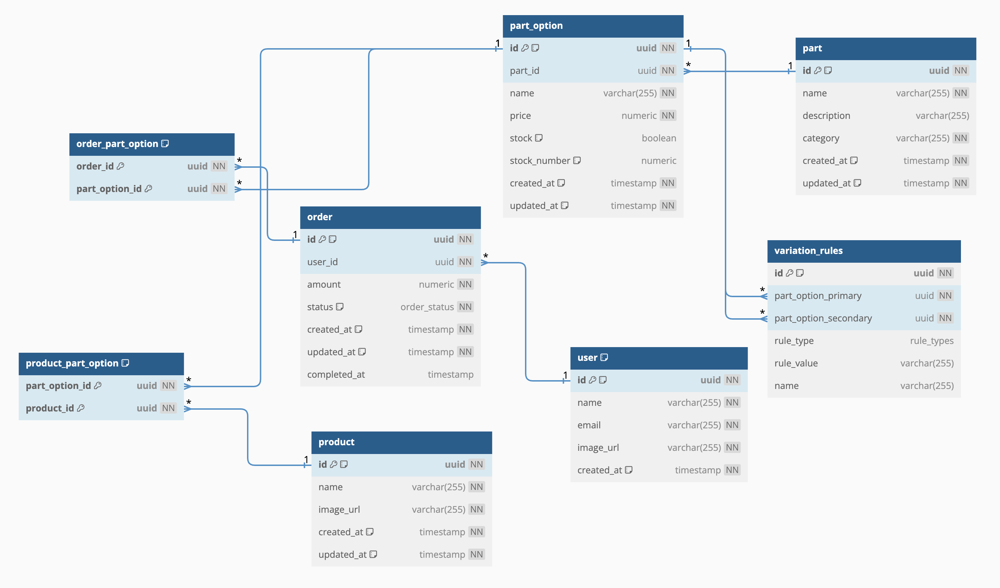

# Data model

## Overview

The data model is designed to support a product configuration and order management system. It primarily revolves around users, products, orders, and the customizable parts of those products. The model is relational, ensuring data integrity and efficient querying.

### Entities and Relationships

1. **User**
   - **Description**: Represents a user in the system who can place orders.
   - **Fields**:
     - `id`: Unique identifier for the user.
     - `name`: User's full name.
     - `email`: User's email address.
     - `image_url`: URL to the user's profile image.
     - `created_at`: Timestamp of when the user was created.

2. **Order**
   - **Description**: Represents an order placed by a user.
   - **Fields**:
     - `id`: Unique identifier for the order.
     - `user_id`: Foreign key linking to the `user` table.
     - `amount`: Total amount for the order.
     - `status`: Current status of the order (e.g., pending, completed).
     - `created_at`: Timestamp of when the order was created.
     - `updated_at`: Timestamp of the last update to the order.
     - `completed_at`: Timestamp of when the order was completed.

3. **Product**
   - **Description**: Represents a product already setted that can be ordered; like a Bicycle, skis or a surfboard.
   - **Fields**:
     - `id`: Unique identifier for the product.
     - `name`: Name of the product.
     - `image_url`: URL to the product image.
     - `created_at`: Timestamp of when the product was created.
     - `updated_at`: Timestamp of the last update to the product.

4. **Part**
   - **Description**: Represents a configurable part of a product; like handlebars, brakes, or chains.
   - **Fields**:
     - `id`: Unique identifier for the part.
     - `name`: Name of the part.
     - `description`: Detailed description of the part.
     - `category`: Category the part belongs to.
     - `created_at`: Timestamp of when the part was created.
     - `updated_at`: Timestamp of the last update to the part.

5. **Part Option**
   - **Description**: Represents an option available for a specific part.
   - **Fields**:
     - `id`: Unique identifier for the part option.
     - `part_id`: Foreign key linking to the `part` table.
     - `name`: Name of the part option.
     - `price`: Price associated with this part option.
     - `stock`: Boolean indicating if the option is in stock.
     - `stock_number`: Number of units available for this option.
     - `created_at`: Timestamp of when the part option was created.
     - `updated_at`: Timestamp of the last update to the part option.

6. **Variation Rules**
   - **Description**: Defines the rules for compatible part options.
   - **Fields**:
     - `id`: Unique identifier for the rule.
     - `part_option_primary`: Foreign key linking to the primary `part_option`.
     - `part_option_secondary`: Foreign key linking to the secondary `part_option`.
     - `rule_type`: Type of rule (e.g., inclusion, exclusion).
     - `rule_value`: Specific value associated with the rule.
     - `name`: Name or description of the rule.

### Many-to-Many Relationships

1. **Order Part Option**
   - **Description**: Connects orders to part options.
   - **Fields**:
     - `order_id`: Foreign key linking to the `order` table.
     - `part_option_id`: Foreign key linking to the `part_option` table.

2. **Product Part Option**
   - **Description**: Connects products to part options, indicating which options are available for a product.
   - **Fields**:
     - `product_id`: Foreign key linking to the `product` table.
     - `part_option_id`: Foreign key linking to the `part_option` table.
