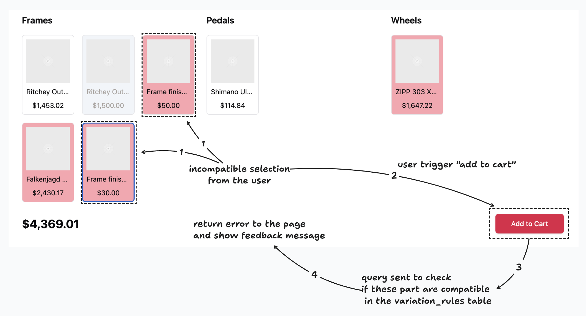

# User actions

## By pages

### Public

- `/products`: List of available products
- `/products/[productId]`: Product detail page with customization options *
- `/customization`: Page to build custom products based on the available part & options
- `/cart`: Summary of user selection and where order will be created

### Admin management

- `/dashboard`: Private page to manage different features of the store
- `/dashboard/products`: Private page to manage product creation and update *
- `/dashboard/parts`: Private page to manage creation of part, part options & variations rules *
- `/dashboard/users`: Private page to manage users
- `/dashboard/orders`: Private page to manage orders

### Private (not implemented)

- `/users/[userId]/profile`: Private page for user profile management
- `/users/[userId]/orders`: Private page to list the current order by user

## Product Page (`/products/[productId]`)

The product detail page is where users can view detailed information about a specific product, such as a bicycle, and customize it according to their preferences before making a purchase.

- Live view: [https://facto-store.vercel.app/products/7e2d7ac1-cc4d-4bca-8030-60b6b997fd3e](https://facto-store.vercel.app/products/7e2d7ac1-cc4d-4bca-8030-60b6b997fd3e)
- Code: [page.tsx](../app/products/[productId]/page.tsx)
- Mockup: [image](./assets/product-page.png)

### UI Presentation

- **Product Overview**: At the top of the page, users are presented with a product image (or a placeholder if no image is available), the product name ("Mountain Bike"), a brief description, and the average customer rating based on reviews (not included in the database).
- **Pre-configured Setup**: Below the overview, there's a recommended setup section that highlights a pre-configured set of parts chosen. This setup includes various components like brakes, chains, and wheels, with each part's name and price clearly displayed.
- **Customization Section**: Users are provided with the option to further customize the product. This section is visually structured with various part categories (e.g., Brakes, Chains, Handlebars) and displays the available options for each category. Selected options are highlighted, and prices are updated in real-time as users make changes (client side action).
- **Dynamic Price Update**: At the bottom of the customization section, the total price is displayed and dynamically updates based on the user's selections.

### Calculating Available Options

- **Retrieving Parts and Options**: The system retrieves parts and options using the `getPartsWithOptions()` method. The options are displayed within each category (e.g., Brakes, Chains) as selectable items. Selected options are highlighted, providing clear feedback to the user.
- **Stock and Availability**: The system checks the availability of each part option. Out-of-stock items are either greyed out, ensuring that users can only select available options.
- **Compatibility Rules**: The system uses the `variation_rules` table to enforce compatibility between selected parts. For example, if a user selects a specific wheelset, only compatible frame options will remain selectable, while incompatible ones will be disabled or hidden.

### Price Calculation

- **Base Price and Additional Costs**: The price calculation begins with the base price of the product. As users select or change part options, the additional costs of those options are added to the base price. This is reflected in the dynamically updating total price displayed beneath the customization options.
- **Real-time Updates**: The total price is recalculated in real-time as users modify their selections, ensuring transparency in pricing and helping users stay within their budget.

## Add to Cart Action

The "Add to Cart" button allows users to proceed with purchasing their customized product after finalizing their selections.

### Process Overview

Add to Cart Action
When a customer interacts with the product page and decides to add a product to the cart after making specific selections, the following sequence of actions occurs:

1. **User Selections**:
   - The user selects various components of the product (e.g., frames, pedals, wheels) from the available options presented on the UI. Each option is associated with a specific `part_option_id` in the database.
2. **Compatibility Check**:
   - When the user triggers the "Add to Cart" action, the system performs a compatibility check to ensure that the selected components can work together. This involves querying the `variation_rules` table in the database.
   - The `variation_rules` table contains rules defining which `part_option_ids` are compatible with each other. The query checks if the selected options comply with these rules.
3. **Error Handling**:
   - If the system finds that the selected components are incompatible, it prevents the user from adding the item to the cart. An error message is displayed on the UI, guiding the user to adjust their selections.
4. **Adding to Cart**:
   - If the selected components are compatible, the system proceeds to add the item to the cart. The following details are persisted in the database:
       - Order Entry: A new record is created in the order table, capturing the user’s ID, the total amount (calculated based on the selected options), and other order-related metadata.
       - Order-Part Association: Each selected component (with its associated `part_option_id`) is recorded in the `order_part_option` table, linking it to the newly created order.
5. **Price Calculation**:
   - The total price is dynamically calculated based on the prices of the selected components. This is done by summing up the prices of each `part_option_id` selected by the user. The total price is then displayed on the UI and stored in the order table when the item is added to the cart.
6. **UI Feedback**:
   - After successfully adding the item to the cart, the UI updates to reflect the new cart status, possibly including a confirmation message or updating the cart icon to indicate the number of items in the cart.

### Conclusion

The user actions on the product page and the "Add to Cart" functionality are designed to provide an intuitive shopping experience. The UI guides users through the customization process, with real-time updates on pricing and availability. The system ensures that all selections are valid before they are persisted in the database, reducing the likelihood of errors and enhancing the overall user experience.

## Admin management

### Workflow: Creation of a New Product

1. **Accessing the Product Creation Interface**:
   - Navigate to the `/dashboard/products` page and clicks on the "Create Product" button.
   - A new form appears where he can input the basic details of the product.

2. **Entering Product Information in the detail tab**:
   - **Name**: Provides a name for the new product (e.g., "Mountain Bike").
   - **Description**: Add a detailed description that highlights the product’s features and potential customizations.
   - **Category**: The product’s category (e.g., Bicycles, Skis, Surfboards, etc) is selected from a dropdown list.

3. **Configuring Parts and Options in the detail part & options tab**:
   - After filling in the product details, is possbible moves to the "Parts & Options" tab, where it can be choosen the available part options for the product.
   - Each part (e.g., wheels, brakes) and its associated options (e.g., specific models and colors) are selected from a list.
   - **Validation of Part Options**: The system checks the compatibility of selected part options using predefined rules in the `variation_rules` table. If any incompatible selections are made, the system alerts to review the options.

4. **Saving the Product**:
   - After completing the configuration, clicks "Save Changes," which stores the product details and available options in the database.

### Database Changes

- **`product` Table**: A new entry is created with the product’s name, description, category, image URL, and timestamps.
- **`product_part_option` Table**: New entries are created linking the product ID to each selected part option ID, specifying the available customizations for the product.

### Workflow: Addition of a New Part Choice

1. **Navigating to the Parts Management Section**:
   - Navigate to the `/dashboard/parts` page, where all parts and their options are listed.

2. **Adding a New Part Option**:
   - Select the relevant part category (e.g., Wheels) to which he wants to add a new option.
   - He then clicks on "Add Option" and fills in the details for the new part option:
     - **Name**: A unique name for the new option (e.g., "Red Rim Color").
     - **Price**: The price associated with this option.
     - **Stock**: The initial quantity available for this option.
     - **Size**: If applicable, it can be define the size variants for this part option.

3. **Saving the New Option**:
   - Click "Save Changes", which adds the new part option to the database, making it available for use in product configurations.

### UI Presentation

- **Part Management Interface**: The interface shows a list of parts, with expandable sections to view and manage existing options. The new option form appears as a modal or inline form where it can input the necessary details.
- **Form for New Part Option**: Includes fields for name, price, stock, and size, allowing to easily add new options.

### Database Changes

- **`part_option` Table**: A new entry is created with the name, price, stock, part ID, and other relevant details. This makes the new option available for selection in product configurations.
- **`variation_rules` Table**: If necessary, new rules can be added or updated to ensure that the new part option is compatible with other options.

## Workflow: Setting Up Prices

### Process Overview

1. **Adjusting Part Prices**:
   - The admin navigates to the `/dashboard/parts` page and selects the part option whose price needs to be updated.
   - He edits the price directly in the "Parts & Options" section by inputting the new price in the designated field.

2. **Defining Special Pricing for Combinations**:
   - To set special prices for certain combinations, use the same parts management section.
   - He can define a rule specifying a unique price when certain part options are selected together (e.g., a discount when both a specific frame and wheelset are chosen).

3. **Saving the Price Adjustments**:
   - Once the changes are made, "Save Changes," updating the prices and special rules in the database.

### UI Presentation

- **Price Management Interface**: The UI presents a straightforward list of part options with editable price fields. It can easily adjust prices or define special pricing rules using dropdowns and input fields.
- **Combination Pricing Interface**: If it is needed to set special prices for combinations, a separate interface or modal allows to select the relevant parts and set the combination pricing.

### Database Changes

- **`part_option` Table**: The price of the specific part option is updated in the table.
- **`variation_rules` Table**: New rules or updates are added to handle special pricing for specific part combinations, ensuring these are applied during the product configuration process.

### Conclusion

These workflows provide a structured and intuitive approach to manage products, part options, and pricing in the store. The UI is designed for ease of use, allowing quick access to critical functions, while the database changes ensure that all configurations and pricing rules are accurately reflected in the system.
